# 📡 Protocolo de Comunicación Socket.IO - PongLab

## 📋 Tabla de Contenidos

1. [Canales Cliente → Servidor](#canales-cliente--servidor)
2. [Canales Servidor → Cliente](#canales-servidor--cliente)
3. [Patrones de Broadcasting](#patrones-de-broadcasting)
4. [Secuencias de Comunicación](#secuencias-de-comunicación)
5. [Sincronización Multi-Servidor](#sincronización-multi-servidor)

---

## 🏁 Resumen del Protocolo

### Estadísticas de Canales
- **7 canales** cliente → servidor
- **7 canales** servidor → cliente  
- **3 canales** Redis para sincronización
- **4 tipos** de broadcasting (completo, unidireccional, condicional, filtrado)

---

## 📤 Canales Cliente → Servidor

### 1. `join-room`
**Descripción**: Unirse a una sala existente o crear una nueva  
**Payload**:
```typescript
interface JoinRoomData {
  roomName: string;        // Nombre de la sala (max 20 chars)
  password: string;        // Contraseña opcional
  playerName: string;      // Nombre del jugador (max 20 chars)
}
```

**Validaciones**:
- Nombre de sala único globalmente
- Nombre de jugador único globalmente  
- Límites de longitud (20 caracteres)
- Contraseña opcional

**Respuesta**: `room-joined` o `error`

---

### 2. `get-rooms`
**Descripción**: Solicitar lista de salas disponibles  
**Payload**: `void` (sin datos)

**Respuesta**: `rooms-list`

---

### 3. `start-game`
**Descripción**: Iniciar juego (solo para host)  
**Payload**:
```typescript
interface StartGameData {
  selectedPlayerIds: string[];  // IDs exactos de 2 jugadores
}
```

**Validaciones**:
- Solo el host puede iniciar
- Exactamente 2 jugadores seleccionados
- Jugadores deben estar en la sala

**Respuesta**: `game-started` o `error`

---

### 4. `game-update`
**Descripción**: Actualizar estado de juego (paletas)  
**Payload**:
```typescript
interface GameUpdateData {
  ball?: {
    x: number;
    y: number;
    vx: number;
    vy: number;
  };
  paddles: {
    player1: number;  // Posición Y de paleta jugador 1
    player2: number;  // Posición Y de paleta jugador 2
  };
  scores?: {
    player1: number;
    player2: number;
  };
}
```

**Validaciones**:
- Solo jugadores activos en juego
- Valores dentro de límites de campo
- Física validada del lado servidor

**Respuesta**: `game-update` (broadcast) o `error`

---

### 5. `update-selected-players`
**Descripción**: Actualizar selección de jugadores (solo host)  
**Payload**:
```typescript
interface UpdateSelectedPlayersData {
  selectedPlayers: string[];  // Array de IDs de jugadores
}
```

**Validaciones**:
- Solo el host puede actualizar selección
- Máximo 2 jugadores seleccionados
- Jugadores deben estar en la sala

**Respuesta**: `room-update` (broadcast)

---

### 6. `back-to-lobby`
**Descripción**: Regresar al lobby desde el juego  
**Payload**: `void`

**Validaciones**:
- Solo jugadores en juego activo
- Host puede terminar el juego

**Respuesta**: `room-update`

---

### 7. `leave-room`
**Descripción**: Salir de la sala  
**Payload**: `void`

**Validaciones**:
- Jugador debe estar en una sala
- Si es host, se elimina la sala completa

**Respuesta**: `room-deleted` o `room-update`

---

## 📥 Canales Servidor → Cliente

### 1. `room-joined`
**Descripción**: Confirmación exitosa de unión a sala  
**Payload**:
```typescript
interface RoomJoinedData {
  success: boolean;
  isHost: boolean;
  message?: string;  // Solo si success = false
  room: string;      // Nombre de la sala
}
```

**Comportamiento**:
- `success = true`: Unirse exitoso, cambiar a vista lobby
- `success = false`: Error, mostrar mensaje al usuario

---

### 2. `room-update`
**Descripción**: Actualización completa del estado de sala  
**Payload**:
```typescript
interface RoomUpdateData {
  name: string;              // Nombre de la sala
  hostName: string;          // Nombre del host original
  hostId: string;            // ID del host original
  players: Player[];         // Jugadores principales
  guests: Player[];          // Invitados
  gameState: GameState | null;  // Estado del juego
  isGameActive: boolean;        // Si hay juego activo
  selectedPlayers: string[];    // IDs de jugadores seleccionados
}
```

**Cuándo se envía**:
- Después de unirse a sala
- Cuando alguien se une/sale
- Al seleccionar jugadores
- Al iniciar/regresar de juego

---

### 3. `game-started`
**Descripción**: Juego iniciado, cambiar a vista de juego  
**Payload**:
```typescript
interface GameState {
  players: Player[];
  scores: { player1: number; player2: number };
  ball: {
    x: number;
    y: number;
    vx: number;
    vy: number;
    lastTouched?: "player1" | "player2";
  };
  paddles: { player1: number; player2: number };
  winner: string | null;
  timestamp: number;
}
```

**Comportamiento**: Todos los clientes cambian a vista de juego

---

### 4. `game-update`
**Descripción**: Actualización de estado de juego en tiempo real  
**Payload**: `GameState` (mismo que game-started)

**Frecuencia**: 120 FPS (cada ~8ms durante juego activo)

**Comportamiento**: 
- Solo clientes en vista de juego reciben actualizaciones
- Clientes actualizan posiciones de paletas y pelota
- Verificación de ganador en cada actualización

---

### 5. `rooms-list`
**Descripción**: Lista de salas disponibles  
**Payload**:
```typescript
interface RoomListItem {
  name: string;
  hostId: string;
  players: Player[];
  guests: Player[];
  gameState: any;
  isGameActive: boolean;
}
type RoomsListData = RoomListItem[];
```

**Comportamiento**: Actualiza lista de salas en UI

---

### 6. `room-deleted`
**Descripción**: Sala eliminada (host salió o fue expulsado)  
**Payload**: `void`

**Comportamiento**: Todos los clientes regresan a vista de unión

---

### 7. `error`
**Descripción**: Error en alguna operación  
**Payload**:
```typescript
interface ErrorData {
  message: string;  // Mensaje descriptivo del error
}
```

**Tipos de errores comunes**:
- "Room not found"
- "Incorrect password"  
- "El nombre de jugador ya está en uso"
- "Unauthorized - Only the host can start the game"
- "Must select exactly 2 players"

---

## 📡 Patrones de Broadcasting

### 1. Broadcast a Sala Completa
```typescript
// Enviar a todos en la sala incluyendo emisor
io.to(roomName).emit('room-update', roomData);

// Enviar a todos EXCEPTO emisor
socket.to(roomName).emit('game-update', gameState);
```

**Usado para**:
- Actualizaciones de sala
- Selecciones de jugadores
- Cambios de estado de juego

---

## 🔄 Secuencias de Comunicación


### Secuencia: Inicio de Juego

```mermaid
sequenceDiagram
    participant H as Host
    participant S as Servidor
    participant P1 as Jugador 1
    participant P2 as Jugador 2
    
    H->>S: start-game([player1Id, player2Id])
    
    S->>S: Validar que H es host
    S->>S: Validar exactamente 2 jugadores
    S->>S: Crear estado de juego inicial
    S->>S: Iniciar física del juego
    
    S->>H: game-started(gameState)
    S->>P1: game-started(gameState)
    S->>P2: game-started(gameState)
    
    S->>S: Iniciar loop de broadcasting 120fps
    loop 120 FPS
        S->>H: game-update(gameState)
        S->>P1: game-update(gameState)
        S->>P2: game-update(gameState)
    end
```


### Secuencia: Actualización de Juego

```mermaid
sequenceDiagram
    participant P as Jugador
    participant S as Servidor
    participant O as Otros Jugadores
    
    P->>S: game-update({paddles: {player1: 250}})
    
    S->>S: Validar jugador está en juego
    S->>S: Aplicar física del lado servidor
    S->>S: Actualizar estado de juego
    S->>S: Verificar ganador
    
    S->>O: game-update(gameState)  // Solo a otros jugadores
```


### Secuencia: Failover de Servidor

```mermaid
sequenceDiagram
    participant C as Cliente
    participant SA as Servidor A
    participant SB as Servidor B
    participant R as Redis
    
    SA->>R: publishPrimaryServerElection()
    
    SA->>C: [Desconectado]
    
    SB->>R: receivePrimaryServerElection()
    SB->>SB: Elegir como líder
    
    C->>SB: [Reconectar automáticamente]
    
    SB->>R: getAllActiveRooms()
    SB->>SB: Restaurar salas desde Redis
    
    loop Para cada sala restaurada
        SB->>C: room-update(restoredRoomData)
    end
```


---

## 📊 Esquemas de Datos

### Player
```typescript
interface Player {
  id: string;              // Socket ID único
  name: string;            // Nombre del jugador (max 20)
  room: string;            // Nombre de la sala
  isHost: boolean;         // true solo para host original
  isActive: boolean;       // Estado de conexión
}
```

### Room
```typescript
interface Room {
  name: string;            // Nombre de la sala
  password: string | null; // Contraseña opcional
  hostName: string;        // Nombre del host original
  hostId: string;          // ID del host original
  players: Map<string, Player>;     // Jugadores principales
  guests: Map<string, Player>;      // Invitados
  gameState: GameState | null;      // Estado del juego
  isGameActive: boolean;            // Si hay juego activo
  selectedPlayers: string[];        // IDs de jugadores seleccionados
}
```

### GameState
```typescript
interface GameState {
  players: Player[];              // Los 2 jugadores del juego
  scores: {                       // Marcador
    player1: number;
    player2: number;
  };
  ball: {                         // Estado de la pelota
    x: number;
    y: number;
    vx: number;
    vy: number;
    lastTouched?: "player1" | "player2";
  };
  paddles: {                      // Posiciones de paletas
    player1: number;              // Posición Y (0-500)
    player2: number;              // Posición Y (0-500)
  };
  winner: string | null;          // ID del ganador o null
  timestamp: number;              // Timestamp de la actualización
}
```

### Estrategias de Recuperación

#### 1. Reintento Automático
```typescript
// Para errores de red
socket.on('connect_error', (error) => {
  setTimeout(() => {
    socket.connect();
  }, 2000);  // Reintentar en 2 segundos
});
```

#### 2. Validación del Lado Cliente
```typescript
// Prevenir errores antes de enviar
const canStartGame = isHost && selectedPlayers.length === 2;
if (!canStartGame) return;
```

#### 3. Estado de Recuperación
```typescript
// Restaurar estado tras reconexión
socket.on('room-update', (roomData) => {
  if (roomData.isGameActive) {
    setCurrentView('game');
  } else {
    setCurrentView('lobby');
  }
});
```

---

### Proceso de Sincronización

1. **Publicación de Cambios**
   ```typescript
   // En cada cambio significativo
   await publishGameState(roomName, {
     roomName,
     state: currentGameState,
     timestamp: Date.now(),
     serverId: getServerId()
   });
   ```

2. **Recepción de Actualizaciones**
   ```typescript
   await subscribeToGameState(roomName, (message) => {
     const { state, timestamp, serverId } = JSON.parse(message);
     updateRoomState(roomName, { state, timestamp, serverId });
   });
   ```


