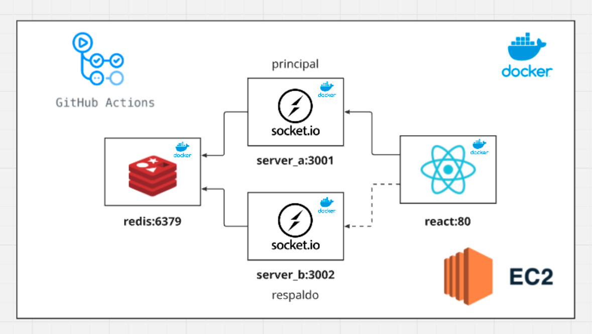

# 🎮 PongLab - Distributed Systems Laboratory


## 📖 Project Description

**PongLab** is a distributed systems laboratory that implements a multiplayer Pong game with high availability and automatic failover. The project demonstrates fundamental distributed systems concepts including server replication, state synchronization, load balancing, and automatic failure recovery.

## 🏗️ System Architecture

### Distributed Client-Server Model



### 🖥️ Distributed Servers
- **Primary Server (Port 3001)**: Handles most connections and operations
- **Backup Server (Port 3002)**: Automatically takes control if the primary fails
- **Automatic Failover**: Primary server election system using Redis
- **State Synchronization**: Game states synchronized between servers via Redis

## 🛠️ Technologies Used

### Frontend
- **React 18** - User interface library
- **TypeScript** - Static typing for better development
- **Vite** - Fast build tool
- **Socket.IO Client** - Real-time communication with servers
- **TailwindCSS** - CSS framework for responsive design

### Backend
- **Node.js** - JavaScript runtime
- **TypeScript** - Static typing
- **Express.js** - Minimalist web framework
- **Socket.IO** - Bidirectional real-time communication
- **Redis** - In-memory database for cache and synchronization
- **ts-node** - TypeScript executor for development time

### DevOps and Containers
- **Docker** - Application containerization
- **Docker Compose** - Multi-service orchestration
- **Multi-stage builds** - Docker image optimization

### Distributed Systems Infrastructure
- **State Synchronization** - Redis Pub/Sub for server communication
- **Automatic Failover** - Leader election system
- **Load Balancing** - Automatic connection distribution
- **Fault Tolerance** - Automatic recovery from disconnections

## 🎯 Key Features

### 🕹️ Multiplayer Game
- **Game Rooms**: Create and join rooms with optional password
- **Player Selection**: Host selects 2 players for the match
- **Game Physics**: Server-side physics calculations to prevent cheating
- **Real-Time**: State updates at 120 FPS

### 👥 Player Management
- **Unique Names**: Strict validation to avoid duplicate names
- **Length Limits**: Maximum 20 characters for room and player names
- **Connection States**: Automatic detection of disconnections and reconnections
- **Exclusive Host**: Only the room creator can delete the room

### 🔄 Failover System
- **Automatic Detection**: Continuous monitoring of server status
- **Leader Election**: Distributed algorithm to select primary server
- **State Synchronization**: Automatic restoration of rooms and players
- **Transparent Recovery**: Players do not notice the server switch

### 📡 Real-Time Communication
- **Socket.IO**: Low-latency bidirectional communication
- **Synchronous Events**: Action synchronization across all clients
- **Heartbeat**: Continuous verification of active connections
- **Automatic Reconnection**: Automatic session reestablishment

## 🚀 Installation and Execution

### Prerequisites
- Node.js 18+ 
- Docker and Docker Compose
- Git

### Quick Installation with Docker
```bash
# Clone the repository
git clone <repository-url>
cd pong-lab

# Build and run all services
docker-compose up --build

# Access the application
# Frontend: http://localhost:5173
# Primary Server: http://localhost:3001
# Backup Server: http://localhost:3002
